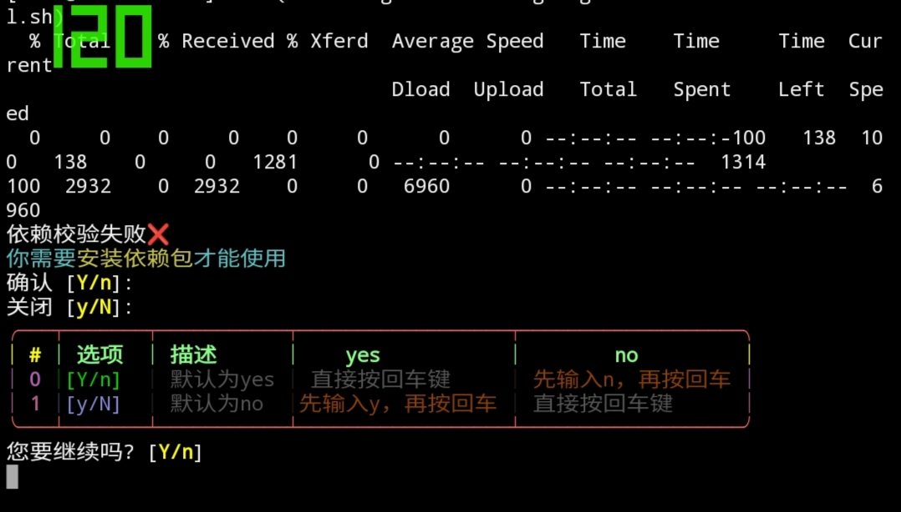

<div style="text-align: center;">
  <h1>牛逼的工具箱(NBUM)</h1>
  <h1>凌风哎（lingfengai）</h1>
</div>
  
凌风NB  

___

#功能介绍

## 已实现的功能

- [x] 安卓工具箱（Termux专用）  
    - [x] 一键美化 [原项目地址](https://github.com/remo7777/T-Header "T-Header")  
- [x] QQ机器人（Yunzai-Bot）  
    - [x] 一键部署  
    - [x] 一键启动  
    - [x] 一键修复版本过低  
- [x] 刷只因工具（作用几乎为零）  
    - [x] ADB安装与使用  
    - [x] OZIP转ZIP [原项目地址](https://github.com/liyw0205/oziptozip "oziptozip")  
*没错就这么点功能*  

### 预想实现的内容  

- [ ] Yunzai-Bot插件一键安装和卸载  
- [ ] 为MT终端安装Proot容器  

___

## 安装教程  

*推荐使用一键安装脚本*

1.  执行一键安装脚本  
```
bash <(curl -L gitee.com/lingfengai/nbum/raw/master/install.sh)
```
2.  回车确认安装依赖  
  
3.  回车确认克隆本仓库  
  

___

## 使用说明  

~~如果你不是傻bi的话应该不用教~~（bushi）  
通过键盘或Termux下发导航栏的`↑↓`来选择一个选项  
通过键盘或Termux下发导航栏的`←→`来选择“yes”或“no”  
选择一个选项后回车确认  
选择“no”后回车退出  

___

## 贡献者/作者  

|    名称     |     设备     |
|    :----:   |    :----:   |
| 凌风哎     | [Gitee](https://gitee.com/lingfengai) |
| lingfengai   |  终端git上传  |
