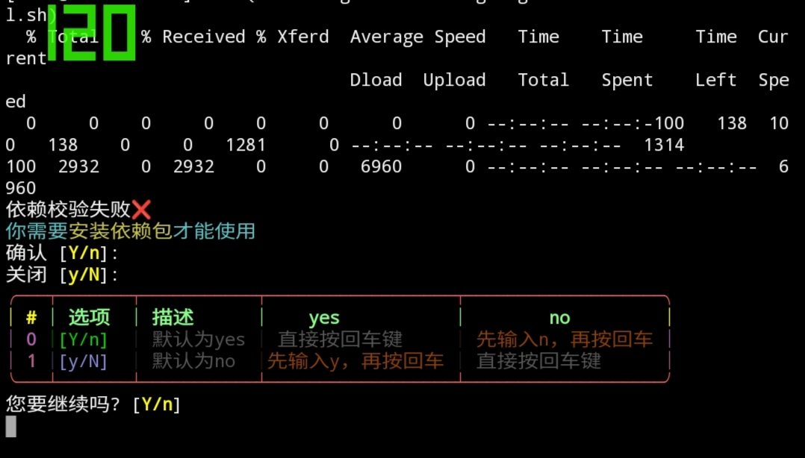

# nbum

#### 介绍
 _现有功能_ 
 **Android工具箱** 
 **计算器** 
 **（好像没有了…）** 

#### 安装教程

1.  执行一键安装脚本
`bash <(curl -L gitee.com/lingfengai/nbum/raw/master/install.sh)`
2.  
3.  

#### 使用说明

1.  还
2.  没
3.  写
4.  呢

